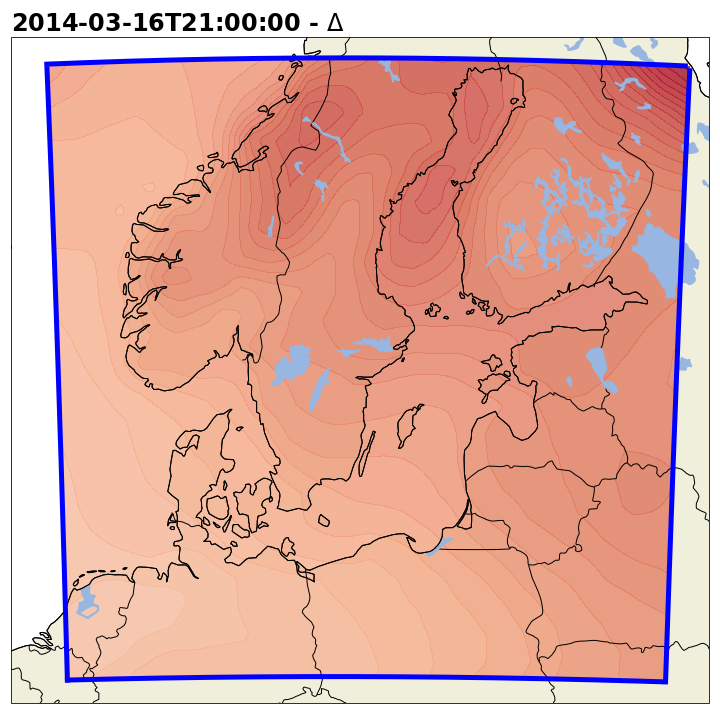

# Python scripts

- **compute_deltas_SURFEX_nc.py**
  
  Delta computation from EC-Earth LESM to use with SURFEX offline. 

- **retrieve_data_ERA5_nc.py**
  
  Retrieve ERA5 data for selected period and region of interest.

- **create_forcing_SURFEX_nc.py**

  Create SURFEX forcing files from ERA5 data and the PGW delta values.

  If PGW deltas are used the forcing variables are modified as followed:

  **Addition of delta**

  A different delta is applied for every time step.

  | Variables |  ERA5 data  |   Delta   |   Result  |
  | :-------: | :---------: | :-------: | :-------: |
  |     *Tair*    Qair    PSurf    Wind |  |  |  |

  **Multiplication of delta**

  For every time step the daily delta value is multiplied.

  | Variables |  ERA5 data  |   Delta   |   Result  |
  | :-------: | :---------: | :-------: | :-------: |
  |     *DIR_SWdown*    LWdown |  |  |  |

  **Addition and multiplication of deltas**

  This is a combined method of addition and multiplication. First the delta is added to the monthly accumulated field. Then the fraction is computed between the new and the old accumulated monthly value. This fraction is multiply to every time step within the month.

  Step 1 - correction of monthly accumulated values
  | Variables |  ERA5 data  |   Delta   |   Result  | 
  | :-------: | :---------: | :-------: | :-------: |
  |     *Rainf*    Snowf |  |  |  |

  Step 3 - multiply the new delta (fraction)
  | Variables |  ERA5 data  |   Delta   |   Result  |
  | :-------: | :---------: | :-------: | :-------: |
  |     *Rainf*    Snowf |  |  |  |

